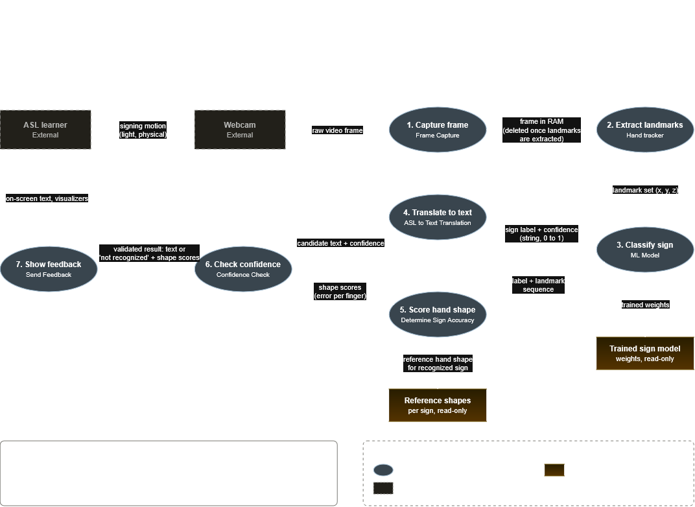

# Design D0: ASL Learning Assistant

Team: Braden Monnin, Connor Slutsky, Isaac Dowdy

**Goal:** give self-taught ASL learners instant English text and hand-shape feedback from a webcam, without storing their video data.

**Input:** live webcam video of the learner performing an ASL sign.
**Output:** English text translation of the sign, plus feedback on the user's formation of the sign.

---
## Block Diagram

https://app.diagrams.net/#Lasl_block_diagram.drawio#%7B%22pageId%22%3A%22asl-block%22%7D

---

## Component responsibility table

| Component | Responsibility | Interfaces in | Interfaces out | Primary owner |
|---|---|---|---|---|
| Frame capture | Holds each webcam frame in RAM only until the Hand tracker has finished with it. | I2 | I3 |  |
| Hand tracker | Finds hand positioning from video frames, finishing with the rest position. | I3 | I4 |  |
| ML Model | Classifies completed signs to its highest confidence match. | I4 | I5, I6 |  |
| ASL to Text Translation | Maps a classified sign label to its English text. | I6 | I7 |  |
| Determine Sign Accuracy | Scores how closely the performed hand shape matches the reference shape for the recognized sign. | I5 | I8 |  |
| Confidence Check | Decides whether a result is trustworthy enough to show, or the sign should be reported as not recognized. | I7, I8 | I9 |  |
| Send Feedback | Presents the final text, hand-shape feedback, or warning to the learner on screen. | I9 | I10 |  |

External (not built by us): **ASL learner** (I1 out, I10 in) and **Webcam** (I1 in, I2 out).

---

## Interface specification table

Every non-OK `status` value (`OUT_OF_FRAME`, `CAMERA_UNAVAILABLE`) is passed through unchanged by every stage down to Send Feedback, and stages skip their own work when it is set. That is how the out-of-frame warning (AC-01.2) reaches the learner without extra arrows.

| ID |  | Inputs / outputs | Data format | Protocol | Error handling |
|---|---|---|---|---|---|
| I1 | 
| I2 | 
| I3 |
| I4 | 
| I5 | 
| I6 |
| I7 | 
| I8 | 
| I9 | 
| I10 | 

### Example 

---

## Data-flow diagram

https://app.diagrams.net/#Lasl_data_flow_diagram.drawio#%7B%22pageId%22%3A%22asl-dfd%22%7D

---

## Architecture pattern and justification

---

## Decision log

