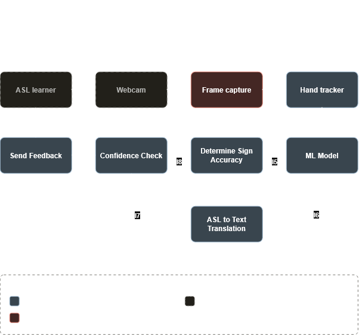

# Design D0: ASL Learning Assistant

Team: Braden Monnin, Connor Slutsky, Isaac Dowdy

**Goal:** give self-taught ASL learners instant English text and hand-shape feedback from a webcam, without storing their video data.

**Input:** live webcam video of the learner performing an ASL sign.
**Output:** English text translation of the sign, plus feedback on the user's formation of the sign.


---
## Block Diagram

https://app.diagrams.net/#Lasl_block_diagram.drawio#%7B%22pageId%22%3A%22asl-block%22%7D



---

## Component responsibility table

| Component | Responsibility | Interfaces in | Interfaces out | Primary owner |
|---|---|---|---|---|
| Frame capture | Holds each webcam frame in RAM only until the Hand tracker has finished with it. | I2 | I3 | Braden Monnin |
| Hand tracker | Finds hand positioning from video frames, finishing with the rest position. | I3 | I4 | Isaac Dowdy |
| ML Model | Classifies completed signs to its highest confidence match. | I4 | I5, I6 | Connor Slutsky |
| ASL to Text Translation | Maps a classified sign label to its English text. | I6 | I7 | Isaac Dowdy |
| Determine Sign Accuracy | Scores how closely the performed hand shape matches the reference shape for the recognized sign. | I5 | I8 | Braden Monnin  |
| Confidence Check | Decides whether a result is trustworthy enough to show, or the sign should be reported as not recognized. | I7, I8 | I9 | Connor Slutsky |
| Send Feedback | Presents the final text, hand-shape feedback, or warning to the learner on screen. | I9 | I10 | Braden Monnin |

External (not built by us): **ASL learner** (I1 out, I10 in) and **Webcam** (I1 in, I2 out).

---

## Interface specification table

| ID | Inputs | Outputs | Output Data format | Output Protocol | Error handling |
|---|---|---|---|---|---|
| I1 | Hand signs (physical movement) from ASL Learner (User) | Hand signs (physical movement) to Webcam | N/A - handled by hardware | N/A - handled by hardware | Error in webcam - outputted to client via Feedback, unrecognized hand signs - low confidence score from Confidence Checker outputed via Feedback |
| I2 | Visual information (video) from Webcam | Visual information (video) to Frame Capture | MediaStream / video object | HTML5 MediaDevices | Corrupted video - caught by Frame Capture and outputted eventually via Feedback | 
| I3 | Live video stream context | Pixel frame matrix  | ImageBitmap | Local Browser Main Thread Memory | Stalled Stream Exception: If the camera stream freezes, a timeout event handler safely re-initializes the video stream track. | 
| I4 | Pixel matrix containing hand features | Time-window of extracted finger joint coordinates over a sequence of frames | Array / Queue | In-Memory Sequential Queue | Landmarks not detected - caught by hand tracker and outputted eventually via Feedback |    
| I5 | Label (string) and landmark sequence (tensor) from ML model | label and landmark sequence (vector) to Sign Accuracy Determiner | Vector | Direct transfer | Gaps in landmark sequence caught by Sign Accuracy Determiner |
| I6 | Sign label (string) / confidence (double) from ML Model | Sign label / confidence (vector) to Translator | Vector / JSON | Direct transfer / HTTP (REST) | Unrecognized sign caught by ML Model | 
| I7 | Text (string) and confidence (double) from Translator | text and confidence (vector) to Confidence Checker | Vector | Direct transfer | Translation error (e.g. unable to translate) caught by Translator |
| I8 | Scores (tensor) from Sign Accuracy Determiner | Scores (tensor) to Confidence Checker (no change) | Tensor | Direct transfer | Direct transfer without change won't cause errors? | 
| I9 | Text (string) and shape scores (tensor) from Confidence Checker | Text and shape scores (object) to Feedback (client) | JSON | HTTPS | Error in inputs in Confidence Checker caught and transferred to Feedback |
| I10 | Text (string) and shape scores (tensor) from Feedback | text (string) and shape scores (string) outputted to ASL Learner / User | Strings | Browser display | Error in processing text and scores caught by Feedback and displayed to User |

Notes / Assumptions: 
 - I3 - hand tracker might be backend
 - I3 - we can start development locally with http, but https is probably preferred for a full deployment for the security
 - I4 - hand tracker and ML model might both be backend components, and if they're in the same source code file you could pass the landmarks directly to the model. Otherwise, if we want to split them into separate services we can use HTTP / REST API. 

### Example 

Payload for I9
```json
{
  "timestamp": 1709425831005,
  "status": "recognized",
  "recognized_text": "C",
  "overall_confidence": 0.92,
  "shape_scores": {
    "thumb_trajectory": 0.88,
    "index_curl": 0.91,
    "middle_curl": 0.85,
    "ring_curl": 0.42, 
    "pinky_curl": 0.38
  }
}
```
---

## Data-flow diagram

https://app.diagrams.net/#Lasl_data_flow_diagram.drawio#%7B%22pageId%22%3A%22asl-dfd%22%7D


---

## Architecture pattern and justification

The chosen architecture pattern will be a combination of a client-server and pipeline. The client-server will do the initial application load to the user's browser. The pipeline pattern will be the core application logic. The data will flow forward through the local client. It will start with the raw video frames from the webcam. This will get transformed into landmark coordinates by the hand tracker, then will be assed to the ML model for classification. It will then be combined with accuracy scores and rendered to the UI. This fits the problem because we need a way to transform a continuous stream of raw pixels into visual feedback which a pipeline works well for. It also should be easy to install which a web app of client-server pattern works great for. Our team has skills in both web development and some machine learning. To have the feedback feel like real-time, the latency should be under 100ms. By getting the execution pipeline to be in local browser memory, the time for feedback can drop significantly. With having a server only distributing static files and not processing video, the hosting costs can be near zero. We can also scale to thousands of users without paying for heavy backend compute. Running the application as a local pipeline can open up running the application to more devices rather than being constrained to only one. A pattern we rejected is the microservices architecture. This would be where the hand tracker, ML model, and translation logic would each be separated into independent backend services communicating by APIs. Doing this would introduce network latency hampering the real time feedback and be more difficult to keep the biometric data completely private. It would also require more money in hosting compared to other options.

---

## Decision log

Application Delivery Platform

Alternatives: Building a native Windows application, Building a Web App, Native iOS app

Chosen option: We chose the Web App. While a native Windows application would provide better frame-processing performance via direct hardware access, it also would alienate Mac, Linux, Chromebook, and mobile users. A Native iOS app could be convenient for a user, but it would increase development costs and a web app can provide a near similiar experience. The web app allows us to deliver the application universally through a browser while keeping all data processing local.


ML Pipeline Concurrency Strategy

Alternatives: Executing the Hand Tracker and ML Model pipeline synchronously on the browser's main thread versus isolating the execution within a background Web Worker.

Chosen option: We chose to isolate the ML processing pipeline in a background Web Worker. Real-time ASL feedback is highly sensitive to performance and timing. If we run heavy tensor math and transformations on the main thread, the DOM will block, causing the webcam feed and visuals to freeze. Moving the pipeline to a Web Worker allows the main thread to remain 100% dedicated to rendering the UI smoothly.


ML Model Input Representation

Alternatives: Feeding raw video frame pixels directly into a heavy Convolutional Neural Network (CNN) to predict the sign, versus using a pre-processor like MediaPipe to extract 3D hand landmarks first and passing only that lightweight coordinate array into a smaller ML model.

Chosen option: We chose to extract landmarks first. Raw video data contains many pixels per each frame which means an end-to-end video CNN would be massive and impossible to run smoothly inside a web browser. By using the Hand Tracker to reduce the image down to just 21 sets of 3D coordinates, we shrink the data footprint significantly. This allows our final classification model to be tiny, fast, and capable of running locally in WebAssembly.


Handling Interrupted Video Data

Alternatives: Instantly clearing the classification and failing if the Hand Tracker loses the user's hand for a single frame, versus implementing a sliding window that buffers and holds the last known coordinates for a brief duration.

Chosen option: We chose to implement a temporal buffering window. In a real-world webcam environment, lighting changes, fast movements, or the user's hand briefly turning away from the lens will cause the Hand Tracker to drop frames. If we instantly failed, the UI feedback would constantly flicker on and off, severely frustrating the learner. A smoothing buffer makes the pipeline fault-tolerant, ensuring stable visual feedback even when the camera briefly loses tracking.
